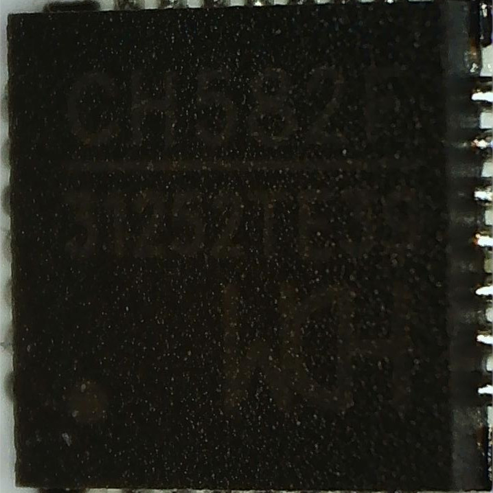
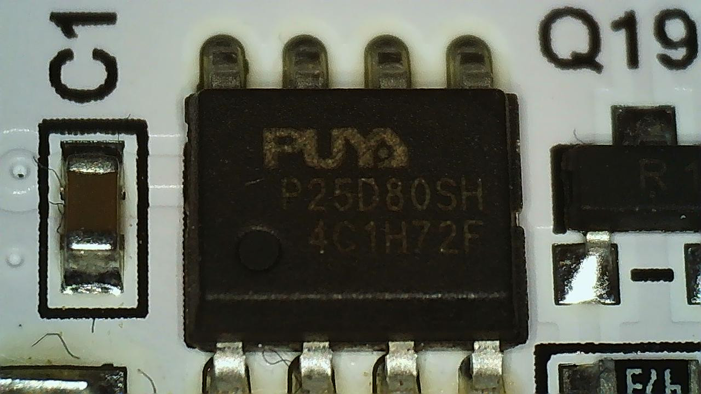

# Neo65 Tri-mode
The Neo65 Tri-mode is based on a Westberry Tech WB32FQ95 MCU in a LQFP64 
package and can be programmed with wb32-dfu. The keyboard uses a WCH CH582F 
chip running a proprietary firmware to provide wireless connectivity. This is 
a community port which was derived from a partial source originally released 
by the manufacturer and reverse engineered by probing the hardware directly.


## Status
Work on this board is currently in progress.
- [x] Document basic components
- [x] Probe and verify matrix
- [x] Basic wired functionality
- [ ] Add support for QSPI Flash
- [ ] Backport Westberry Trimode Wireless
- [ ] Fix invalid USB VID/PID

## Flashing a new firmware
Hold ESCAPE [0,0] to enter bootloader mode while inserting the USB cable into
the keyboard. Then run the following to flash the firmware.
```shell
make neo/neo65_trimode:default:flash
```


## What wireless chip is the Neo65 using?
The Neo65 uses a WCH CH582F running a custom firmware to provide wireless
connectivity. The CH582F is attached to UART1 on the WB32FQ92.




## What flash is the WB32FQ95 using on the Neo65?
The WB32FQ95 on the Neo65 is using a Puya P25D80SH serial flash.
* QSPI
   * QSPI_SCK is on PB3
   * QSPI_MISO is on PB4
   * QSPI_MOSI is on PB5




## WB32FQ95 which UART is the Neo65 using?
The WB32FQ95 supports 3 UARTS since PA2 and PA3 are used by the matrix we can
rule UART2 out. Probing reveals the UART1 is used to connect to the CH582F.
* UART1 (SD1)
   * UART1_TX is on PA9
   * UART1_RX is on PA10
* UART2 (SD2)
   * UART2_TX is on PA2
   * UART2_RX is on PA3
* UART3 (SD3)
   * UART3_TX is on PC10
   * UART3_RX is on PC11


## What battery charging circuit is present?
A TP4056 IC is onboard which is used for battery charging and management.


## How are the LEDs wired?
* PD2 is wired to the ESD LED
* PA8 is wired to the CAPSLOCK LED
* PC11 is wired to the Q LED
* PC10 is wired to the W LED
* PA15 is wired to the E LED
* PC0 is wired to the R LED (Something is weird with this mapping I need to check it again)

## Reference Material
The following shouldn't be upstreamed but I've included documentation relevant
for porting in the repo to have everything in a single place.
* [WB32FQ95 Data Sheet](documentation/EN_DS1104041_WB32FQ95xC_V01.pdf)
* [WB32FQ95 Reference Manual](documentation/EN_RM2905025_WB32FQ95xx_V01.pdf)
* [WCH CH582F Data Sheet](documentation/CH583DS1.PDF)
* [Puya P25D80SH Data Sheet](documentation/PUYA-P25Q80H-SSH-IT_C194872.pdf)
* [TP4056 Data Sheet](documentation/TP4056.pdf)


## Tools
These are the tools I'm using to reverse engineer the Neo65.

* [Saleae Pro 16 Logic Analyzer](https://www.saleae.com)
* [E-Z Hook X2015 SMD Probes](https://e-z-hook.com/test-hooks/micro-hook/x2015-ultra-thin-double-gripper-micro-test-hook/)
* [Mustool USB Microscope](https://www.eevblog.com/forum/testgear/mustool-g1200-digital-microscope-12mp-7-lcd-display-1-1200x/)
* [Brymen BM789 Multimeter](http://www.brymen.com/PD02BM780_789.html)
