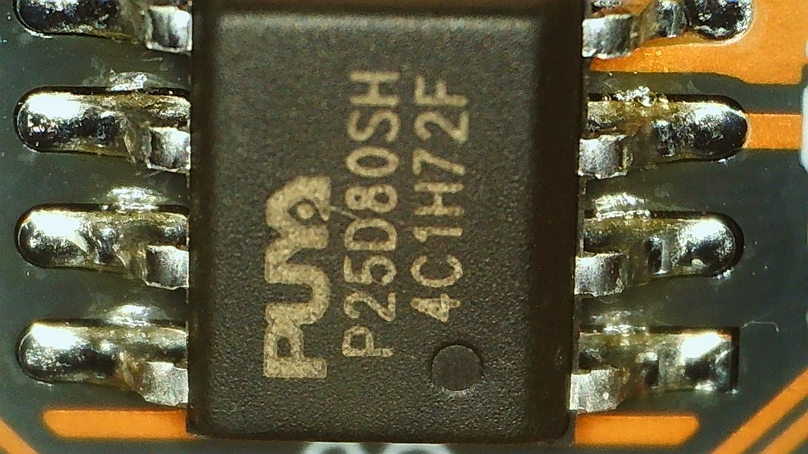

#  Bridge75 ISO
The Bridge75 ISO is based on a Westberry Tech WB32FQ95 MCU in a LQFP64 package
and can be programmed with wb32-dfu. The keyboard uses a WCH CH582F chip
running a proprietary firmware to provide wireless connectivity. This is a
community port which was derived from a partial source originally released by
the manufacturer and reverse engineered by probing the hardware directly. Note
I currently only have ISO PCBs so will focus on that until I can get ahold of
an ANSI PCB to determine what difference need to be made.


## Status
Work on this board is currently in progress.
- [x] Document basic components
- [x] Probe and verify matrix
- [x] Basic wired functionality
- [x] Add support for QSPI Flash
- [x] Backport Updated Westberry Trimode Wireless
- [x] Implement Basic PMIC/Battery Management
- [x] Implement LED Indicators
- [ ] Implement battery level
- [ ] Fix bluetooth

## Flashing a new firmware
Hold ESCAPE [0,0] to enter bootloader mode while inserting the USB cable into
the keyboard. Then run the following to flash the firmware.
```shell
make shortcut/bridge75_iso:default:flash
```


## What wireless chip is the Bridge75 using?
The Bridge75 uses a WCH CH582F running a custom firmware to provide wireless
connectivity. The CH582F is attached to UART1 on the WB32FQ92.
* UART1 (SD1)
   * UART1_TX is on PA9
   * UART1_RX is on PA10


## What flash is the WB32FQ95 using on the Bridge75?
The WB32FQ95 on the Bridge75 is using a Puya P25D80SH serial flash.
* QSPI
   * QSPI_SCK is on PB3
   * QSPI_MISO is on PB4
   * QSPI_MOSI is on PB5




## What battery charging circuit is present?
A TP4056 IC is onboard which is used for battery charging and management. CHRG
is low when charging and high when fully charged.
* STDBY of the TP4056 is wired to GROUND
* CHRG of the TP4056 is wired to PIN PB9


## How are the LEDs wired?
The LEDs are WS2812 the first of which is wired to PB10 and uses the bitbang
driver.


## Reference Material
The following shouldn't be upstreamed but I've included documentation relevant
for porting in the repo to have everything in a single place.
* [WB32FQ95 Data Sheet](documentation/EN_DS1104041_WB32FQ95xC_V01.pdf)
* [WB32FQ95 Reference Manual](documentation/EN_RM2905025_WB32FQ95xx_V01.pdf)
* [WCH CH582F Data Sheet](documentation/CH583DS1.PDF)
* [Puya P25D80SH Data Sheet](documentation/PUYA-P25Q80H-SSH-IT_C194872.pdf)
* [TP4056 Data Sheet](documentation/TP4056.pdf)


## Tools
These are the tools I'm using to reverse engineer the Bridge75.

* [Saleae Pro 16 Logic Analyzer](https://www.saleae.com)
* [E-Z Hook X2015 SMD Probes](https://e-z-hook.com/test-hooks/micro-hook/x2015-ultra-thin-double-gripper-micro-test-hook/)
* [Mustool USB Microscope](https://www.eevblog.com/forum/testgear/mustool-g1200-digital-microscope-12mp-7-lcd-display-1-1200x/)
* [Brymen BM789 Multimeter](http://www.brymen.com/PD02BM780_789.html)
